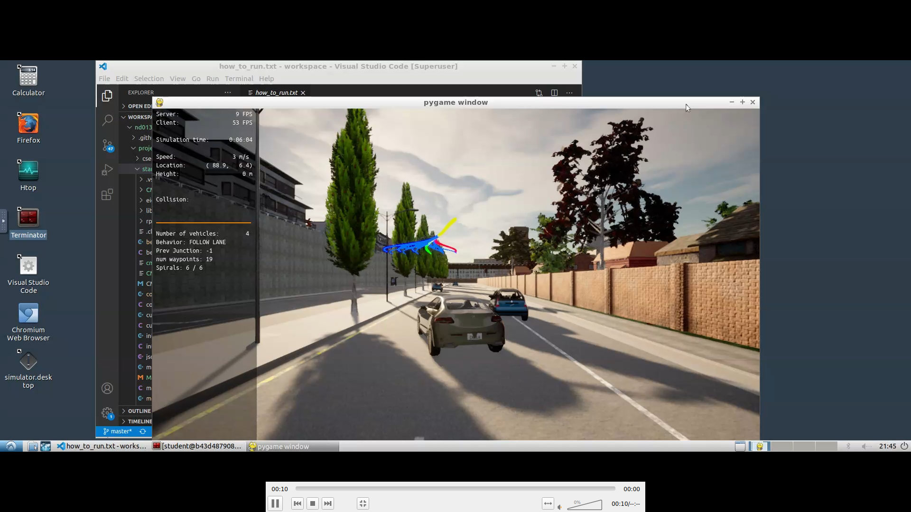
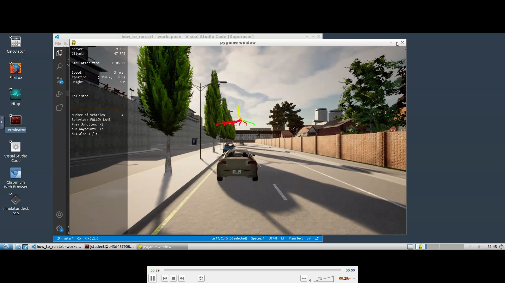
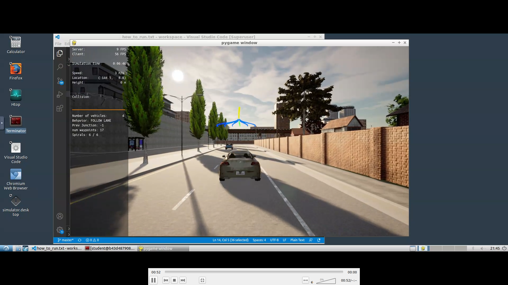
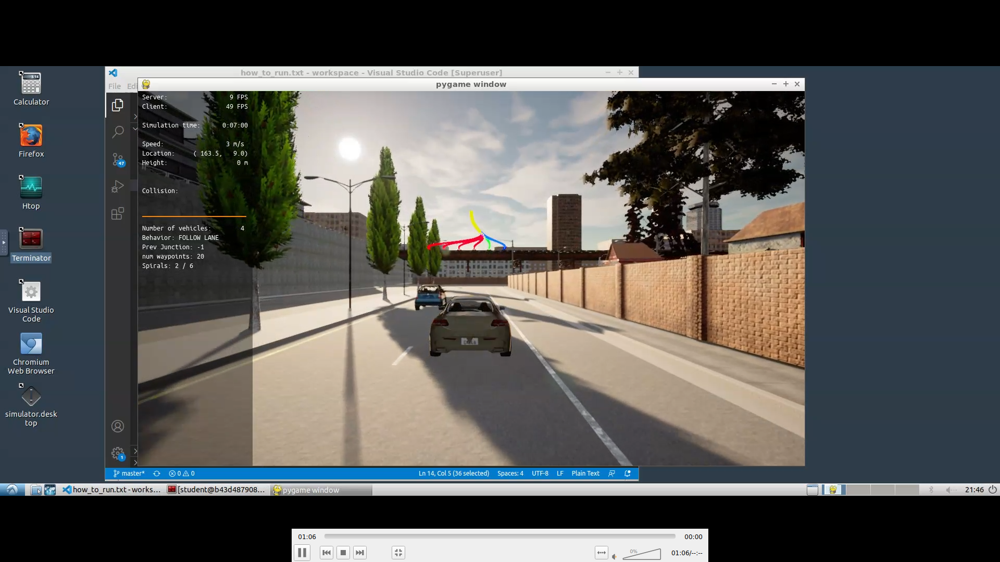
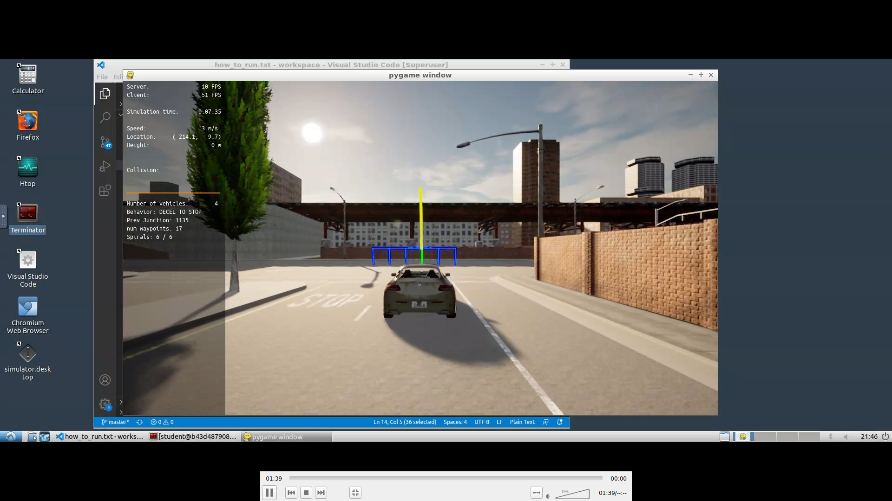

# Udacity-Motion-Planning-and-Decision-Making-Project
This is my project for Udacity Self Driving Cars Nano Degree Fourth Module Motion Planning and Decision Making Project
find video for project running in following link
https://youtu.be/-TW3NbvmcvI
and those are some Sample Images from the video

# How to launch?
1. New terminal window
2. su - student 
3. cd /opt/carla-simulator/
4. SDL_VIDEODRIVER=offscreen ./CarlaUE4.sh -opengl

5. New terminal window
6. git clone https://github.com/udacity/nd013-c5-planning-starter.git
7. Stop here now it's needed to replace the codes open nd013-c5-planning-starter/project/starter_files
8. delete the five file having same name as above
9. upload those five files now
10. cd nd013-c5-planning-starter/project
11. ./install-ubuntu.sh
12. cd starter_files/
13. cmake .
14. make
15. cd nd013-c5-planning-starter/project
16. ./run_main.sh
17. Go to desktop mode to see CARLA

Thank you
